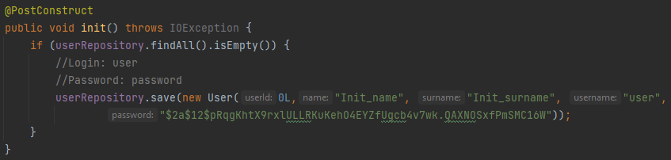
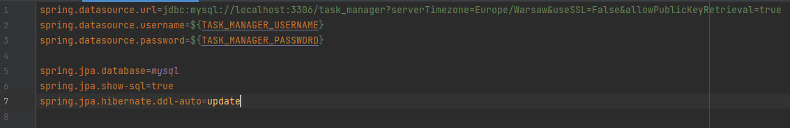
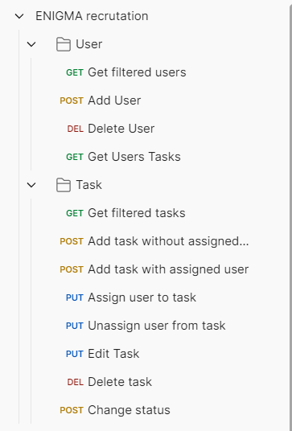

## Enigma Systemy Ochrony Informacji Sp. z o.o.
### Zadanie rekrutacyjne 2:
### Usługa REST do zarządzania zadaniami zespołu - Piotr Łęcicki
### Projekt zawiera:
- autentykację za pomocą Spring Security i danych logowania zapisywanych w bazie
- hashowanie haseł
- automatyczna inicjalizacja pierwszego użytkownika w celu umożliwienia wysyłania żądań HTTP

  (każde żądanie wymaga podania loginu i hasła jednego z użytkowników) 
bez żadnych użytkowników w bazie nie jest możliwe przejście autentykacji
- dodatkowo testy jednostkowe serwisów (niestety niekompletne), dla każdej metody jeden test sprawdzający tylko pozytywny scenariusz
- odpowiednie wyjątki oraz konfiguracja, żeby został zwrócony odpowiedni status w razie wyrzucenia któregoś
- plik zawierający gotowe przykładowe żądania, które można użyć za pomocą programu "Postman"
- standardowe założenia zadania: kontrolery, serwisy, encje, podłączona baza danych
### Jak uruchomić
Należy stworzyć bazę danych MySQL o nazwie 'task_manager' lub dodać do pliku build.gradle inną bazę np. H2, która do celów testowych zdecydowanie wystarczy.  
W projekcie została zastosowana dobra praktyka zaciągania danych wrażliwych ze zmiennych systemowych: 

Należy stworzyć zmienne środowiskowe o nazwach `TASK_MANAGER_USERNAME` oraz `TASK_MANAGER_PASSWORD` z danymi użytkownika bazy danych. Po tym kroku środowisko może wymagać restartu w celu zaciągnięcia wartości tych zmiennych.  
Po skonfigurowaniu bazy danych można przystąpić do uruchomienia metody main w klasie `java/pl/plecicki/taskmanager/TaskManagerApplication.java`.  
Gdy serwer jest uruchomiony można skorzystać z gotowych żądań HTTP do testowania tego projektu importując plik `postman_collection_to_test/ENIGMA recrutation.postman_collection.json` w programie Postman.
